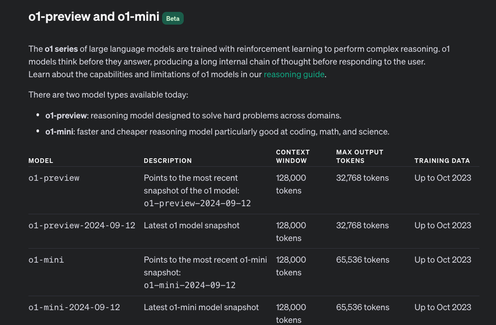

# 0 | FAQ

!!! danger "ChatGPT Plus is Rate limited:   _50 msgs/week_ for `o1-preview`   _50 msgs/day_ for `o1-mini`  Context Window is _128000 tokens_   Max Tokens in Completion Output is _32768 (o1-preview) - 65536 (o1-mini)_"

!!! task "Read the o1 System Card"

    1. [Scorecard](https://openai.com/index/openai-o1-system-card/) - with safety evaluations and a [**Preparedness Framework**](https://openai.com/safety/)
    1. [Report](https://cdn.openai.com/o1-system-card-20240917.pdf) - 42 page PDF with detailed information on the model data and training, evaluations and more.

??? info "1. What is o1 and how is it different? "

    Is a new **series of reasoning models** that are designed to solve hard problems by **thinking before they respond**. 
    
    Uses _reinforcement learning_ to hone its chain-of-thought, refine strategies it uses, recognize & correct mistakes.

    - The **PhD Model** - ["performs similarly to PhD students"](https://openai.com/index/introducing-openai-o1-preview/) on benchmarked tasks in **physics, chemistry, biology**.
    - The **Mathlete** - scored 83% on the Intl. Math Olympiad (vs. 13% for gpt-4o). Top-500 in AIME (US Math Olympiad).
    - The **Competitive Coder** - excels at competitive coding, in [89th percentile on Codeforces for competitive coding](https://openai.com/index/learning-to-reason-with-llms/)

    See: **[Learning to Reason with LLMs](https://openai.com/index/learning-to-reason-with-llms/)** to understand how the model learns to reason and how this breaks down tasks compared to gpt-4o.

    

??? info "2. How do I get access to o1?"

    The model family is currently available from OpenAI, Azure OpenAI and GitHub Models Marketplace. However _access_ for developer usage is limited **and requires additional steps and approvals** which makes it hard to use for casual exploration. Currently the best option is to use ChatGPT Plus (paid subscription) but [note that rate limits keep evolving](](https://help.openai.com/en/articles/9824962-openai-o1-preview-and-o1-mini-usage-limits-on-chatgpt-and-the-api)) for both API-based and Subscription-based access.

    1. GitHub / [OpenAI o1-mini](https://github.com/marketplace/models/azure-openai/o1-mini) - Join the waitlist
    1. GitHub / [OpenAI o1-preview](https://github.com/marketplace/models/azure-openai/o1-preview) - Join the waitlist
    1. Azure OpenAI / [o1-preview](https://ai.azure.com/explore/models/o1-preview/version/1/registry/azure-openai) - Request access
    1. Azure OpenAI / [o1-preview](https://ai.azure.com/explore/models/o1-mini/version/1/registry/azure-openai) - Request access
    1. OpenAI / [API Access](https://help.openai.com/en/articles/9824962-openai-o1-preview-and-o1-mini-usage-limits-on-chatgpt-and-the-api) - Only Usage Tier 3,4,5 have access, with tier-specific rate limits
    1. OpenAI / [ChatGPT Plus](https://help.openai.com/en/articles/9824962-openai-o1-preview-and-o1-mini-usage-limits-on-chatgpt-and-the-api) - 50 msg/week (`o1-preview`) and 50 msg/day (`o1-mini`)

??? info "3. What are the LIMITATIONS?"

    **These are areas where gpt-4o has a natural advantage for now, since it supports them**

    - Text generation only (no images for now)
    - User & assistant messages only (no system messages)
    - Streaming not supported (wait till done)
    - No function calling, response format parameters (tools)
    - Fixed parameters (temp=top_p=n=1, presence_penalty=frequency_penalty=0)
    - Models not support for Assistants API or Batch API
    
??? info "4. What are the CAPABILITIES?"

    1. [**Who is it for?**](https://openai.com/index/introducing-openai-o1-preview/) - Researchers, educators, developers building complex workflows. Anywhere that we have a hard problem that needs to be solved with multi-step reasoning.

    1. **[o1-mini](https://openai.com/index/introducing-openai-o1-preview/)** - faster and 80% cheaper haan o1-preview **but its world knowledge is not as broad**

??? info "5. What are REASONING TOKENS?"

    [**New concept introduced in o1**](https://platform.openai.com/docs/guides/reasoning/how-reasoning-works). Tokens used primarily for the **thinking** steps - once it produces the answer (visible **completion tokens**), it **discards reasoning tokens** from context. _This is what a multi-step conversation looks like now_.

    

??? info "6. What are some PROMPTING TIPS?"

    [From the docs](https://platform.openai.com/docs/guides/reasoning/advice-on-prompting)

    **These models perform best with straightforward prompts**   Some prompt engineering techniques, like few-shot prompting or instructing the model to "think step by step," may not enhance performance and can sometimes hinder it. Here are some best practices:

    - **Keep prompts simple and direct:**  The models excel at understanding and responding to brief, clear instructions without the need for extensive guidance.
    - **Avoid chain-of-thought prompts:**  Since these models perform reasoning internally, prompting them to "think step by step" or "explain your reasoning" is unnecessary.
    - **Use delimiters for clarity:**  Use delimiters like triple quotation marks, XML tags, or section titles to clearly indicate distinct parts of the input, helping the model interpret different sections appropriately.
    - **Limit additional context in retrieval-augmented generation (RAG):**  When providing additional context or documents, include only the most relevant information to prevent the model from overcomplicating its response